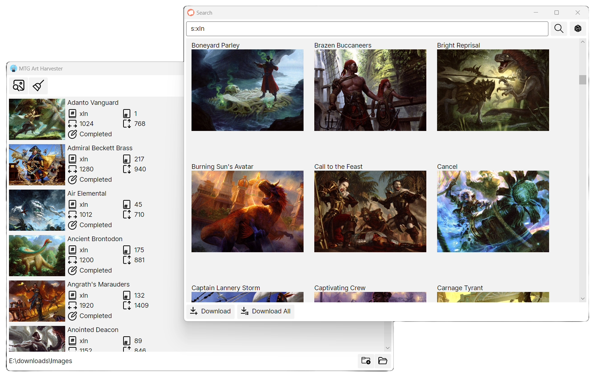

# MTG Art Harvester

Program for searching and downloading MTG art.

### Features

Search art by name or by certain parameters in the request. Syntax description https://scryfall.com/docs/syntax.
Downloading all found art at once.
List of downloads with information on each download.

### How to use
Download and unpack the archive with the latest version https://github.com/evilnw/MTGArtHarvester/releases/
Run the executable MTGArtHarvester

### Known issues

The search result displays a maximum of 175 results.
Sometimes the wrong art loads. This is a feature of the mtgpics.com url.
Sometimes art doesn't load due to the link to mtgpics.com.
The "Show random art" function in search results does not work as quickly as would like.
Basic land art is not displayed.